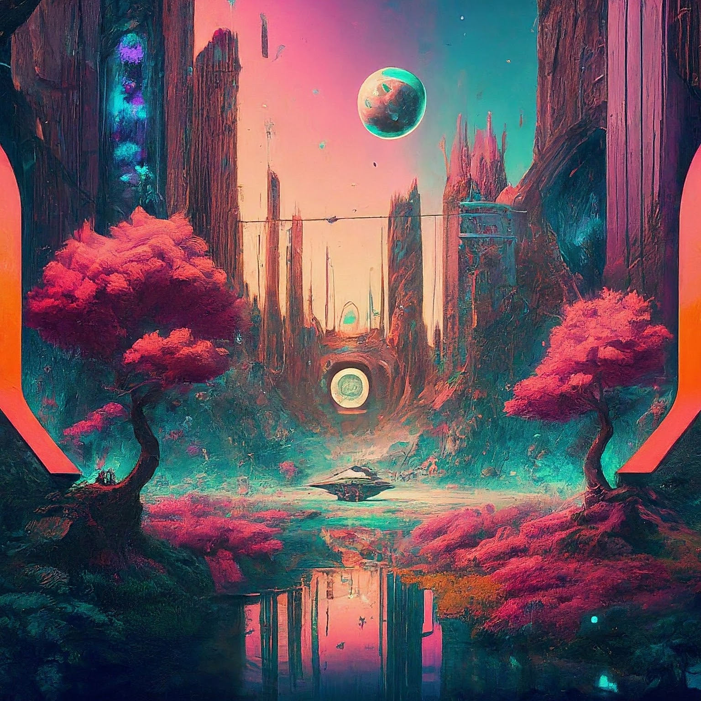

  

    
| 👨🏻‍💻 I’m a final year graduate student at the TU Berlin. |

    
| 🔬 My research interests are in bridging vision and language modalities and Self-Supervised Learning! |

    
| 📚 I’m currently working towards my Master’s Thesis in the field of Vision-Language-Modelling. |

    
| 📽️ I am also interested in assisting others on their path in the world of Machine Learning and academia. |

  

  

    
  

**Selected Experience**
🤖 **Open Source Contributions**
I have experience contributing to Kubernetes a large open-source project for robotic obstacle avoidance using Deep Reinforcement Learning.

Moreover, I have published a respective paper at the IROS conference and in the Robotics and Automation Letters (RA-L) journal.

👨🏻‍🔬 **Professional Experience**
Currently I am a 2nd year Bachelos Student at University of Chittagong studying Pure Mathematics. Additionally, I have experience working in Machine Learning and plan on being a Student Researcher in Machine Learning.
I am also learning Quantum Computing to pursue research.

📚 **Teaching and Community Contributions**
To further contribute to the Machine Learning community, I have a YouTube channel and a Hashnode Blogging account where I publish educational Machine Learning content.